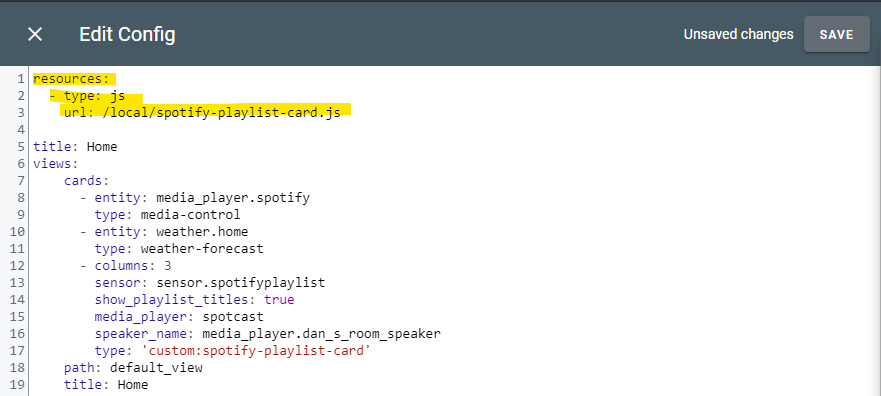

# Spotify Playlist Card

[![GitHub Release][releases-shield]][releases]
[![GitHub Activity][commits-shield]][commits]
[![License][license-shield]](LICENSE.md)

![Project Maintenance][maintenance-shield]
![Project Maintenance][maintainer-shield]

![header][header-image]

This is a Home Assistant Lovelace card that takes your Spotify playlists and creates buttons that will start the playlist when pressed. Requires the [Spotify Playlist sensor][spotify-playlist-sensor], and [Spotify Media Player][spotify-component] to be setup.

Note: There is another Spotify Playlist card by user @fondberg [here](https://github.com/fondberg/spotify-card) that is much cleaner and less hacky than my card. Doesn't require the Feed Parser sensor either. Check it out! I don't plan to make much updates on this card, besides fixing a few bugs. 


## Features
  - Works with [Spotcast component][spotcast] and [Alexa media player component][alexa-media] (still testing).
  - Press/click on the image to start the playlist on the selected media player.
  - Configurable options (number of columns, grid gap, shuffle, playlist title)
  - No white background!

## Installation

### HACS Install
1. Install the [Spotify Playlist sensor][spotify-playlist-sensor] via HACS.
2. Include this [repository][spotify-playlist-card] as a custom plugin in the HACS settings.

```
https://github.com/dnguyen800/spotify-playlist-card
```

 If added correctly, the repository should be listed like below:
 ![hacs][hacs-image]


### Manual install

1. Install the [Spotify Playlist sensor][spotify-playlist-sensor] and confirm your playlists,  URIs and image URLs are loaded in the sensor.
1. Download the [spotify-playlist-card.js][js-file] and save to the `config/www` folder
3.  If you edit your Lovelace configuration using `ui-lovelace.yaml`, include the card code at the top of the `ui-lovelace-card.yaml`. If using the Lovelace UI editor, enter the `Raw Config Editor` and make sure the following code is at the top of the editor:

```yaml
resources:
  - url: /local/spotify-playlist-card.js
    type: js
```


### Configuration
1. Make sure the [Spotify Playlist sensor][spotify-playlist-sensor] contains playlist data.
2. If you edit your Lovelace configuration using `ui-lovelace.yaml`, add the entry below:

```yaml
- type: "custom:spotify-playlist-card"
  sensor: sensor.spotify_playlist  
  playback_method: spotcast
  speaker_entity: "media_player.google_home"
  show_playlist_titles: true
  shuffle: true
  columns: 3
```

If using the Lovelace UI editor, click on `⋮ >> Configure UI >> + >> Manual Card` and add the entry above, making sure to modify the config to match your entity IDs. If the config works, the card should appear in a preview window to the right.


## Options

| Name | Type | Requirement | Description | Default
| ---- | ---- | ------- | ----------- | -------
| type | string | **Required** | `custom:spotify-playlist-card` | None 
| sensor | string | **Required** | Name of the Spotify Playlist sensor that holds your playlist info.  | None
| columns | int | **Optional** | Number of columns to display. | `3`
| gradient_level | string | **Optional** | Choose a value between 0 and 1 for the gradient level used when `show_playlist_titles` is enabled. | `0.8`
| grid_gap | string | **Optional** | Define the size of the gap between playlist images. | `8px`
| show_playlist_titles| boolean | **Optional** | Add a text title at the bottom of each playlist. | `false`
| shuffle | boolean | **Optional** | Set the Spotify `shuffle` setting. | `false`
| playback_method | string | **Optional** | Speaker playback method for Spotify. Acceptable choices are: `spotcast`, `alexa`, or `spotify` | `spotify`
| speaker_entity | string | **Optional** | The name of the speaker that will play the music. When using Spotcast, use the `entity_id` of the Chromecast device listed in Home Assistant. If using Amazon Echo or Spotify as the media player, list the full entity name, such as "media_player.spotify" | `media_player.spotify`


### Sample for ui-lovelace.yaml:

```yaml
- type: "custom:spotify-playlist-card"
  sensor: sensor.spotify_playlist  
  playback_method: spotcast
  speaker_entity: "media_player.google_home"
  gradient_level: 0.7
  grid_gap: '8px'
  show_playlist_titles: true
  shuffle: true
  columns: 3
```
[hacs-image]: images/hacs.png
[js-file]: https://raw.githubusercontent.com/dnguyen800/spotify-playlist-card/master/dist/spotify-playlist-card.js
[header-image]: images/header.png
[spotcast]: https://github.com/fondberg/spotcast
[spotify-component]: https://www.home-assistant.io/components/media_player.spotify/
[spotify-playlist-card]: https://github.com/dnguyen800/spotify-playlist-card
[spotify-playlist-sensor]: https://github.com/dnguyen800/spotify-playlist-sensor
[alexa-media]: https://github.com/custom-components/alexa_media_player
[Troubleshooting]: https://github.com/thomasloven/hass-config/wiki/Lovelace-Plugins
[commits-shield]: https://img.shields.io/github/commit-activity/y/dnguyen800/spotify-playlist-card.svg?style=for-the-badge
[commits]: https://github.com/dnguyen800/spotify-playlist-card.svg/commits/master
[license-shield]: https://img.shields.io/github/license/dnguyen800/spotify-playlist-card.svg?style=for-the-badge
[maintenance-shield]: https://img.shields.io/maintenance/yes/2019.svg?style=for-the-badge
[maintainer-shield]: https://img.shields.io/badge/maintainer-Dan%20Nguyen%20%40dnguyen800-blue.svg?style=for-the-badge
[releases-shield]: https://img.shields.io/github/release/dnguyen800/Spotify-Playlist-Sensor.svg?style=for-the-badge
[releases-shield]: https://img.shields.io/github/release/dnguyen800/spotify-playlist-card.svg?style=for-the-badge
[releases]: https://github.com/dnguyen800/spotify-playlist-card/releases


## FAQ
- I press on a playlist button but I don't hear the playlist playing.

 If you are using `media_player: spotify`, and not `spotcast` or `echo`, you will not be able to play music on idle speakers. To remedy, start playing Spotify on any device, then try pressing the playlist image again.

## Support
I am studying Python as a hobby and this is my first public project. Unfortunately, I know nothing about Javascript and relied on studying other Lovelace custom cards to write this. Suggestions are welcome but no promises if I can fix anything! If you're familiar with CSS, then you can edit the CSS style in the .js file directly!

## Credits
  - [Tracker-card](https://github.com/custom-cards/tracker-card) which I studied and re-used the button code.
  - [Spotcast](https://github.com/fondberg/spotcast) - Starts Spotify playback on an idle Chromecast device. Fixes a big deficiency with my card--the inability to play music on an idle Chromecast.
  - [Spotify Card](https://github.com/custom-cards/spotify-card) - A great Lovelace Spotify Playlist card that also allows you to select which speaker to play music.

